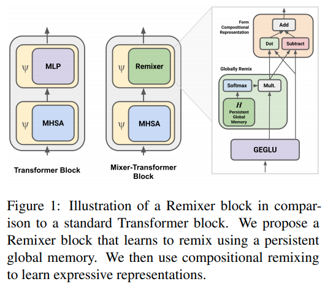

</img>

## Remixer - Pytorch

Implementation of the Remixer Block from the <a href="https://openreview.net/pdf?id=9FHQHJnRtfL">Remixer paper</a>, in Pytorch. It claims that substituting the feedforwards in transformers with sequence wide mixing followed by multiplication and subtraction leads to better language understanding results.


## Install

```bash
$ pip install remixer-pytorch
```

## Usage

```python
import torch
from remixer_pytorch import RemixerBlock

model = RemixerBlock(
    dim = 512,
    seq_len = 1024
)

x = torch.randn(1, 1024, 512)
model(x) # (1, 1024, 512)
```

## Citations

```bibtex
@inproceedings{anonymous,
    title   = {Remixers: A Mixer-Transformer Architecture with Compositional Operators for Natural Language Understanding },
    author  = {Anonymous},
    year = {2021},
    url = {https://openreview.net/forum?id=9FHQHJnRtfL}
}
```
